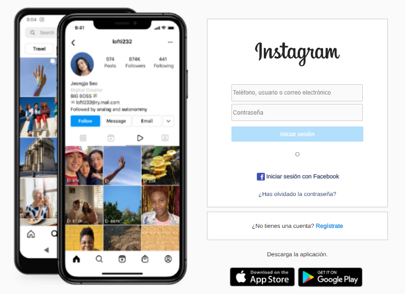
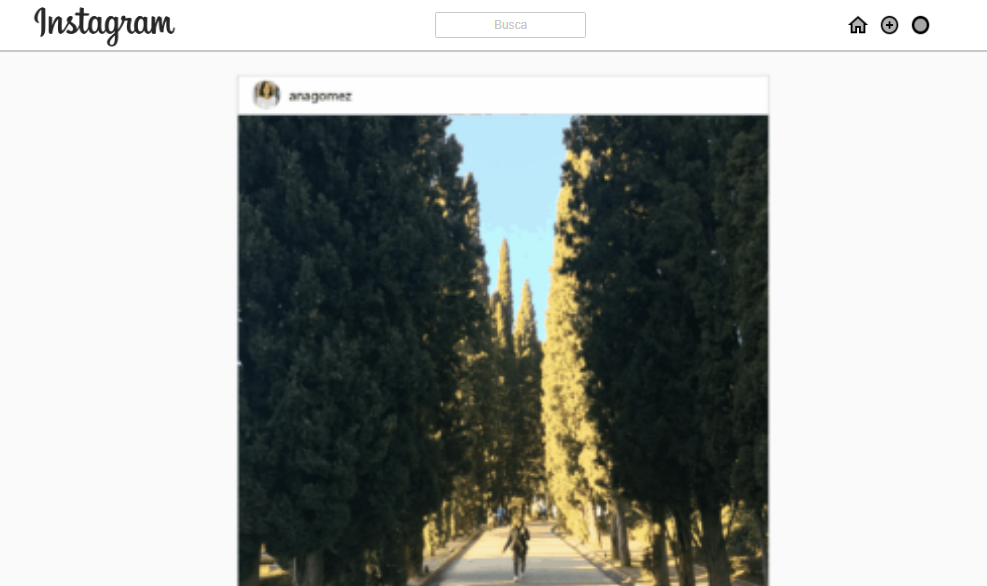

# Proyecto Ejercicios Vacaciones: Html/Css
Este proyecto ha sido desarrollado como trabajo de vacaciones de Pascua. Se trata de una copia del Login de Instagram y la Página Principal del usuario.

## Tecnologías:
Se han usado las siguientes tecnologías para el desarrollo de este proyecto:
* HTML
* CSS

## Instalación y despliegue:
Para desplegar este proyecto debes clonar el repositorio al que te redirige el siguiente link:

```
https://github.com/RebecaASuesta/Ejercicios-Pascua-HTML-CSS
```

## Vista previa:
_Login:_


_Página Principal:_

---

## Autor:
Este proyecto fue desarrollado por [Rebeca] (https://github.com/RebecaASuesta)

## Expresiones de gratitud:
Muchas gracias a mi capacidad de superar los mental breakdowns que me produce CSS.